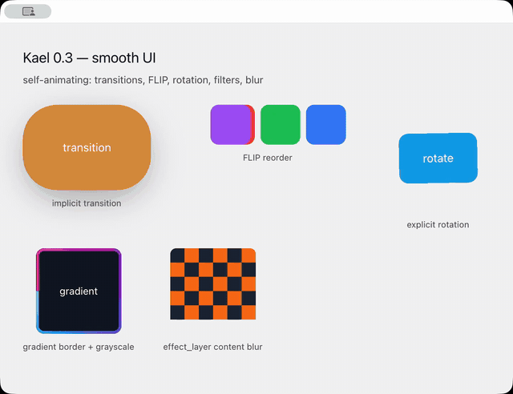

# Kael

A high-performance, GPU-accelerated UI framework for building native-first desktop applications in Rust — IDEs, dashboards, design tools, messaging apps, trading platforms, media tools, and anything else that deserves native speed without bundling a full browser for every window.

> **Kael is a fork of [GPUI](https://github.com/zed-industries/zed/tree/main/crates/gpui)** from [Zed Industries](https://zed.dev), previously distributed as the *adabraka GPUI fork* (`adabraka-gpui`) and since renamed to Kael — the same project, continued under a new name. It is an independent project and is not affiliated with or endorsed by Zed Industries.

Where upstream GPUI prioritizes APIs that serve the Zed editor, Kael is the home for general-purpose features the wider community asks for: radial and conic gradients (shipped), webviews, form controls, rich text, Lottie animations, blur effects, gesture recognition, theming, a built-in component library — and a public render-target + custom shader API as the top of the GPU roadmap. See [VISION.md](VISION.md) for the project's direction and [`docs/src/electron-bridge.md`](docs/src/electron-bridge.md) for the current Electron-gap roadmap.

Kael targets macOS, Linux, and Windows with platform-native rendering backends (Metal, Vulkan/Blade, DirectX 11) and delivers 60fps with minimal CPU usage through dirty tracking and render-on-demand.



> The 0.3 "smooth UI" release: implicit style transitions, FLIP layout animation, subtree transforms, color filters, gradient borders, and content-blur effect layers. Run it with `cargo run -p kael --features runtime_shaders --example showcase_0_3`.

## Features

**Rendering & Graphics**
- GPU-accelerated rendering with per-platform shaders
- Linear, radial, and conic gradients in the core styling API
- Cached surface rendering with dirty tracking (idle at 0% CPU)
- Canvas drawing API with stroked/filled paths, shapes, transforms
- Backdrop blur and frosted glass effects
- Color filters: `grayscale`, `saturate`, `brightness`, `contrast` over a whole subtree
- Gradient borders (`border_gradient`) accepting any linear, radial, or conic gradient
- Effect layers (`effect_layer`) with content blur and silhouette-following drop shadows
- Lottie animation playback with background frame rendering
- SVG rendering and icon atlas system
- Device-pixel snapping (`PixelSnapPolicy`) for crisp output at any DPI
- sRGB-correct render pipeline (Metal color space, linear blending)
- Native macOS rendering parity (SF Pro optical sizing, continuous corners, AppKit-matched text)

**Layout & Elements**
- Flexbox and grid layout (via Taffy)
- Rich text with inline elements, entities, and selection
- Recycling lists for heterogeneous content
- Uniform lists for same-height items
- Implicit style transitions on keyed elements (`transition`/`transition_with`) — interruptible easing of background, borders, color, opacity, radii, shadows, rotation, scale
- Subtree transforms: `rotate`, `scale`, `translate`, and `skew` apply to an element's whole subtree (text, icons, images, children)
- Rounded-corner clipping (`overflow_hidden` + corner radius) clips children on all three backends
- FLIP layout animation (`animate_layout`) glides keyed elements to new positions
- Explicit keyframe and spring animations
- Spring physics (`SpringValue`/`SpringPoint`) and `DraggableSpring`, a throwable container with velocity hand-off and snap points
- Elastic (rubber-band) scrolling
- Gesture recognizers (pan, swipe, pinch)
- Form controls: text input, checkbox, toggle, slider, radio, select, date picker

**Component Library (`kael_ui`)**
- 100+ shadcn-inspired components built in: buttons, inputs, dialogs, data tables, command palettes, charts, and more
- 18 built-in themes plus user-defined brand themes (`Theme::custom`) with live theme switching and semantic design tokens
- Layout primitives (`VStack`, `HStack`, `Grid`, `ScrollContainer`) and responsive utilities
- Professional animations: springs, easing presets, transitions, animated state
- Multi-line code editor with tree-sitter syntax highlighting
- 1,600+ bundled Lucide icons plus Inter / JetBrains Mono fonts
- See [`crates/kael_ui`](crates/kael_ui) — no extra component library needed

**Platform Integration**
- Native menu bars with `MenuBarBuilder` and `MenuBuilder`
- System tray with `TrayMenuBuilder` menus
- Global hotkeys with `GlobalHotkeyBuilder`
- Native open/save dialogs with `OpenDialogBuilder` and `SaveDialogBuilder`
- Deep-link routing with `DeepLinkRouterBuilder`
- Clipboard text helpers plus rich `ClipboardItem` payloads
- Shell helpers for URLs, files, and reveal-in-folder workflows
- Notifications with `NotificationBuilder` convenience APIs and action callbacks
- Printing
- WebViews (macOS WKWebView, Windows WebView2, Linux WebKitGTK via wry) with `webview_controller(...)` handles for web-standard islands such as auth, maps, payments, docs, and advanced media
- Media playback (`MediaSource`, `audio`, `video`, `VideoController`, audio playback-rate control, preload/ready-state/buffered-range events, rendered WebVTT/SRT text tracks, and attribute-style `VideoPlayer::url(...)` / `VideoPlayer::source(...)` wrappers with controls/autoplay configuration and automatic WebView fallback for browser-media manifests)
- Screen and media capture
- Overlay and click-through windows
- Auto-launch, single instance, dock control
- Biometric authentication
- Power-aware rendering (battery detection, animation throttling)

**Architecture**
- Entity-based reactive state management
- Derived state (`Computed<T>`/`cx.computed`) with dependency tracking and invalidation on notify
- Async data helpers (`kael_ui::query`): `Loadable<T>`, `QueryState<T>` (loading/error lifecycle, debounce, refetch), and a TTL `QueryCache`
- Multi-window support
- In-window layer stack (modals, popovers, anchored layers)
- Focus management and keyboard navigation
- Action dispatch system with keybindings
- Theme system with hot-reload from TOML/JSON
- Extension host with external-process RPC and a WASM execution model under active development
- Process isolation (worker children, extension children)
- IPC transport layer
- Session persistence

## Quick Start

Add to your `Cargo.toml`:

```toml
[dependencies]
kael = "0.3"
```

```rust
use kael::*;

struct Counter {
    count: i32,
}

impl Render for Counter {
    fn render(&mut self, _window: &mut Window, cx: &mut Context<Self>) -> impl IntoElement {
        div()
            .flex()
            .flex_col()
            .gap_2()
            .child(format!("Count: {}", self.count))
            .child(
                div()
                    .cursor_pointer()
                    .child("Increment")
                    .on_click(cx.listener(|this, _, _, _| {
                        this.count += 1;
                    })),
            )
    }
}

fn main() {
    Application::new().run(|cx| {
        cx.open_window(WindowOptionsBuilder::new().title("Counter"), |_, cx| {
            cx.new(|_| Counter { count: 0 })
        })
        .unwrap();
    });
}
```

## Examples

```bash
cargo run -p kael --example hello_world
cargo run -p kael --example animation
cargo run -p kael --example recycling_list
cargo run -p kael --example webview_demo
cargo run -p kael --example daemon_app
cargo run -p kael --example form_controls
cargo run -p kael --example platform_features
cargo run -p kael --example crispness_showcase
cargo run -p kael --example native_comparison
```

Component library examples (140+ available, see [`crates/kael_ui/examples`](crates/kael_ui/examples)):

```bash
cargo run -p kael_ui --example custom_theme_demo
cargo run -p kael_ui --example data_table_styled_demo
cargo run -p kael_ui --example command_palette_styled_demo
cargo run -p kael_ui --example pie_chart_demo
```

Starter templates — three complete applications in [`templates/`](templates) to copy as the skeleton of your own app:

```bash
cargo run -p dashboard-app    # analytics: sidebar, stat cards, charts, data table
cargo run -p messaging-app    # chat: conversation list, message bubbles, composer
cargo run -p workspace-app    # IDE shell: file tree, syntax-highlighted editor, status bar
```

## Platform Support

| Platform | Renderer | Status |
|----------|----------|--------|
| macOS | Metal | Full support |
| Linux (X11) | Blade (Vulkan) | Full support |
| Linux (Wayland) | Blade (Vulkan) | Full support |
| Windows | DirectX 11 | Full support |

For OS integrations such as WebView, tray menus, notifications, hotkeys, and
capture, query `CapabilityReport::current()` and gate hard requirements with
`CapabilityCheck` so apps can choose clear setup or fallback paths per desktop.

## Project Structure

The core framework is domain-neutral; domain-specific capability (media playback, audio, editing engines) lives in optional leaf crates behind feature flags, so apps only compile what they use.

```
crates/
├── kael/               # Core framework (no media/audio compiled in by default)
├── kael_ui/            # Component library (100+ shadcn-inspired components)
├── kael-macros/        # Proc macros (derive Render, Action, etc.)
├── kael_render_graph/  # GPU-agnostic pass/resource DAG with cache invalidation
├── kael_gpu_budget/    # GPU memory budget & eviction API
├── collections/        # Optimized collection types
├── refineable/         # Style refinement system
├── util/               # Shared utilities
├── kael_engines/       # General workload engines (BiDi, line breaking, undo, crash reports)
├── kael-media/         # Optional: media playback (feature = "media")
├── kael_audio/         # Optional: audio (feature = "audio")
├── kael_media_engines/ # Optional: timeline/compositing/export engines for media apps
└── ...
```

## Building

```bash
# Check
cargo check -p kael

# Run tests
cargo test -p kael

# Run an example
cargo run -p kael --example hello_world
```

### macOS toolchain

The default macOS build precompiles Metal shaders at build time, which requires the **full Xcode application** — the standalone Command Line Tools (`xcode-select --install`) do **not** ship the Metal compiler. With only the Command Line Tools installed, the build fails with `xcrun: error: unable to find utility "metal"`.

Pick one:

```bash
# Install Xcode from the App Store, then point the toolchain at it:
sudo xcode-select -s /Applications/Xcode.app

# OR compile shaders at app launch (recommended for development — no full Xcode needed):
cargo run -p kael --example hello_world --features runtime_shaders

# OR use the Blade rendering backend instead of Metal:
cargo run -p kael --example hello_world --features macos-blade
```

Use `runtime_shaders` for day-to-day development; build with full Xcode for release builds.

### Linux Dependencies

```bash
# Ubuntu/Debian
sudo apt install libwayland-dev libxkbcommon-dev libvulkan-dev \
  libwebkit2gtk-4.1-dev libgtk-3-dev libdbus-1-dev libnotify-dev

# Fedora
sudo dnf install wayland-devel libxkbcommon-devel vulkan-loader-devel \
  webkit2gtk4.1-devel gtk3-devel dbus-devel libnotify-devel
```

## Acknowledgements

Kael began as a fork of [GPUI](https://github.com/zed-industries/zed/tree/main/crates/gpui), the UI framework created by [Zed Industries](https://zed.dev) for the Zed code editor, and was previously distributed as the *adabraka GPUI fork* (`adabraka-gpui`). The rename to Kael was a rebrand of the same project, not a new fork — and not a severing of ties with upstream: Kael keeps the Apache-2.0 license, credits Zed's foundational work, and selectively tracks upstream GPUI where it benefits Kael users. The original GPUI code is licensed under Apache-2.0. Kael is an independent project and is not affiliated with or endorsed by Zed Industries.

## License

Apache-2.0 — see [LICENSE](crates/kael/LICENSE-APACHE) for details.

Original GPUI code: Copyright 2022-2025 Zed Industries, Inc.
